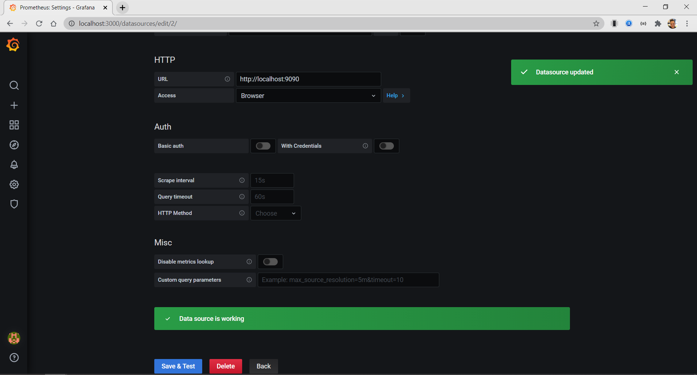
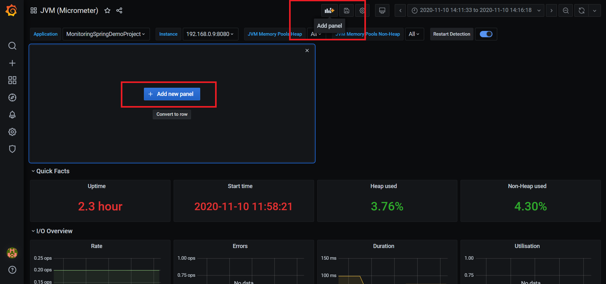
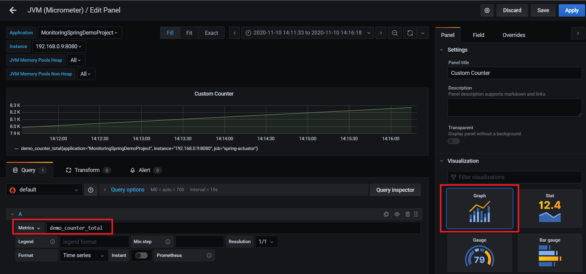

## SPRINGBOOT APP MONITORING WITH PROMETHEUS & GRAFANA

### SETUP SPRING BOOT

I will go through the steps to set up a basic Spring Boot application which we monitor by using Docker images of Prometheus and Grafana.

1.  Set up a regular Spring Boot application by using  [Spring Initializr](https://start.spring.io/).

    Dependencies :
    - Spring web
    - Spring Boot DevTools

2.  Add dependency for Actuator
    ```
        <dependency>
            <groupId>org.springframework.boot</groupId>
            <artifactId>spring-boot-starter-actuator</artifactId>
        </dependency>
    ```
3.  Add dependency for Micrometer
    ```
        <dependency>
            <groupId>io.micrometer</groupId>
            <artifactId>micrometer-registry-prometheus</artifactId>
            <version>1.5.5</version>
        </dependency>
    ```
4.  Expose our needed Prometheus endpoint in the application.properties file
    
    ```
    management.endpoints.web.exposure.include=prometheus
    management.endpoint.health.show-details=always
    management.metrics.tags.application= MonitoringSpringDemoProject
    
    ```
5. Start the application 

    `sudo apt-get install maven`

    Compile the app

    `mvn clean install`

    `cd target`

    `java -jar .jar file`

6.  After this we can run the application and browse to  `localhost:8080/actuator`, where we can see all the available endpoints. The one we need and will use to monitor this application, is  `localhost:8080/actuator/prometheus`.

### PROMETHEUS

`code /tmp/prometheus/prometheus.yml`

and paste the code below

```
global:
    scrape_interval:     15s

scrape_configs:
- job_name: 'prometheus'
  scrape_interval: 5s

  static_configs:
    - targets: ['localhost:9090']

- job_name: 'spring-actuator'
  metrics_path: '/actuator/prometheus'
  scrape_interval: 5s
  static_configs:
    - targets: ['10.0.2.15:8080']
```

 ### GRAFANA

After we arrive at the landing page, we need to set up a data source for Grafana.  
Navigate to Configuration > Data Sources, add a Prometheus data source and configure it like the example below.



http://10.0.2.15:9090

For this example I used one of the premade dashboards which you can find on the  [Grafana Dashboards](https://grafana.com/grafana/dashboards)  page.  
The dashboard I used to monitor our application is the JVM Micrometer dashboard with import id: 4701.


Give your dashboard a custom name and select the prometheus data source we configured in step 3.  
Now we have a fully pre-configured dashboard, with some important metrics showcased, out of the box.


### ADDING A CUSTOM METRIC PANEL

To demonstrate how we can create a panel for one of our own custom metrics, I will list the required steps below.

First we need to add a panel by clicking on “add panel” on the top of the page, and yet again on “add new panel” in the center.



Then we need to configure our panel, which we do by selecting  `demo_gauge`  in the metrics field.  
To display our graph in a prettier way, we can choose the “stat” type under the visualization tab.


When we click on  `Apply`  in the top right corner, our new panel gets added to the dashboard.

Afterwards, we can do the same thing for our  `demo_counter`  metric.



After going through all of these steps, we now have an operational dashboard which monitors our Spring Boot application, with our own custom metrics.


sudo apt-get purge mariadb-server mariadb-client mariadb-common mariadb-server-core-* mariadb-client-core-*


CREATE USER 'exporter'@'localhost' IDENTIFIED BY 'Pass@2024' WITH MAX_USER_CONNECTIONS 3;
GRANT PROCESS, REPLICATION CLIENT, SELECT ON *.* TO 'exporter'@'localhost';

export DATA_SOURCE_NAME='exporter:Pass@2024@(192.168.50.103:3306)/'